footer: @leonbarnard, #stcsf

# [fit] Why Markdown?

### STC SF - March 21, 2018

---

^ I thought I'd zoom way out with this talk. Why are we even talking about Markdown? What's so interesting about it that you're here instead of somewhere else?

^ Let's take a step back from the debate about markdown vs. x, y, z and talk about why markdown even exists and why we're talking about it at a documentation meetup.

^ It was created for blogs. And part of its resurgence now is because docs are becoming a bit like blogs.

^ Basically, it's a shorthand way of writing HTML, the language of the web. It helps to see everything about it through that lens.

---

# Outline

- What it is
- Why it's so popular
- Challenges and limitations
- References

---

## Markdown(-like) syntax is everywhere

* Slack
* Pivotal
* Balsamiq

^ We're living in a rich text world. We want what we write to be more expressive.

^ It's becoming *the* way to write rich text using plain text.
learn it once, use it everywhere

---

# What Markdown is🤔

> “Markdown” is **two things**: (1) a plain text formatting syntax; and (2) a software tool... that converts the plain text formatting to HTML.
-- John Gruber (creator or Markdown)

^ Let's start at the source.

^ For those who don't know, Markdown was created by John Gruber, author of the popular website Daring Fireball.

---

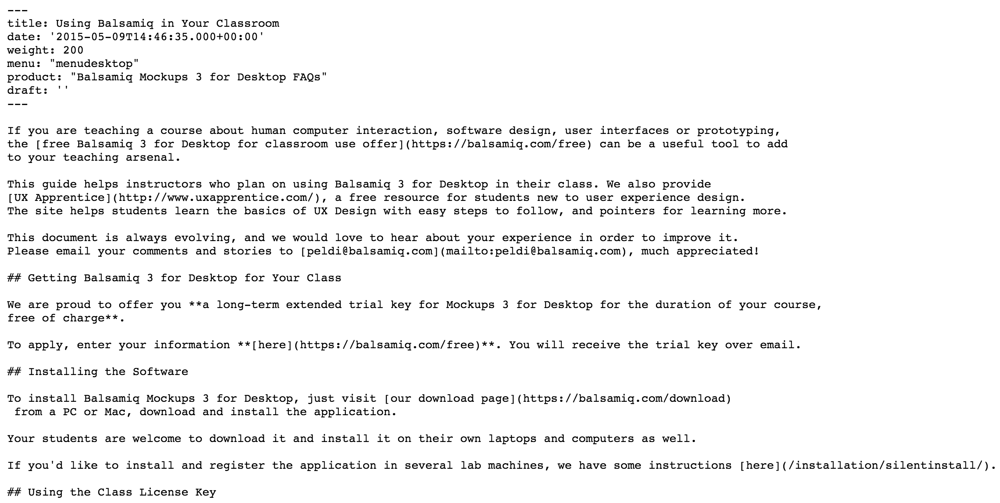

^ It's a plain text file. No special software required to view it.

---

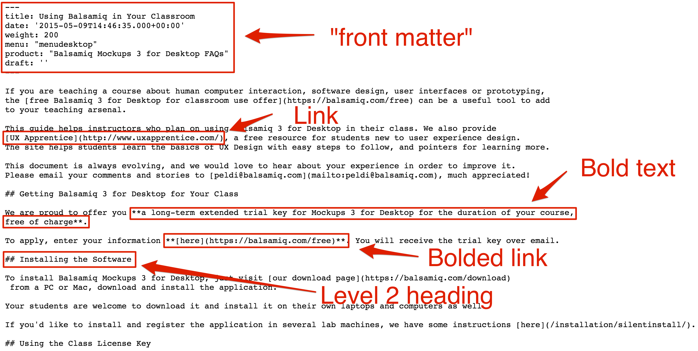

^ Here's the first part of what it is. The syntax.

---

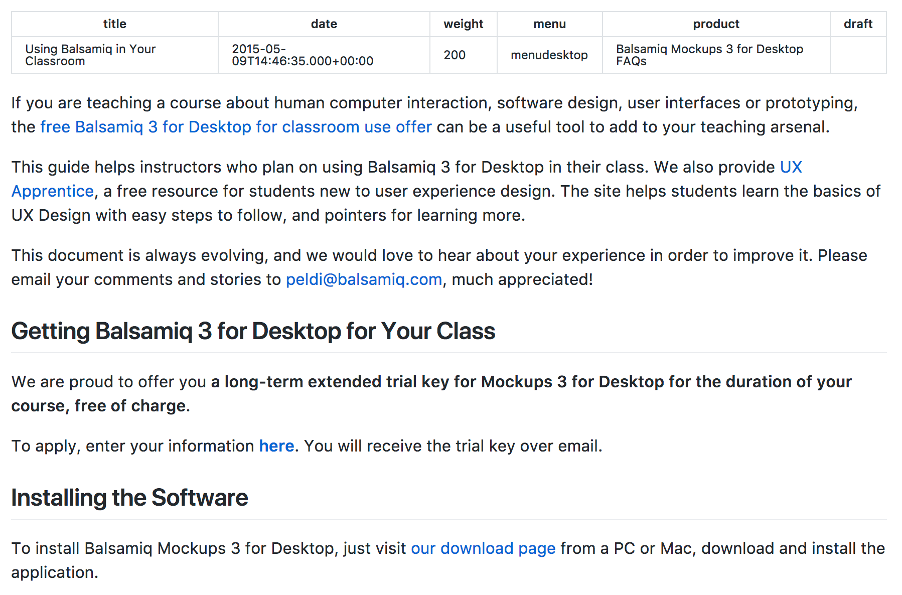

^ Here's the second part. The software-rendered HTML.

---

# Why it's so popular

> Markdown is intended to be as **easy-to-read** and **easy-to-write** as is feasible.
-- John Gruber (creator or Markdown)

^ that's it in a nutshell
Now I'll go into more detail

^ inspired by reStructuredText and others.

---

## Even [the book on it](https://mattgemmell.com/books/#writing-in-markdown) is only 17 pages.

### You can learn it in an afternoon. 

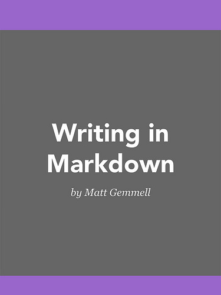

^ easy to read and write also means easy to learn

^ I recommend this one. It's $3.

---

## 1. It's code that can be read by non-coders

From "Writing in Markdown"

> [Y]ou've probably already used Markdown, without being aware of it. If you've ever emphasised something \*like this\*, you've used Markdown. If you've ever made a list by starting each line with a hyphen, or asterisk (or a number), you've used Markdown.... That's the real beauty of it.

^ It's *intuitive*. It doesn't really look like code. But it is!

*Bonus:* it can actually teach you HTML

^ if you look at what it exports

---

## <HTML> vs. Markdown

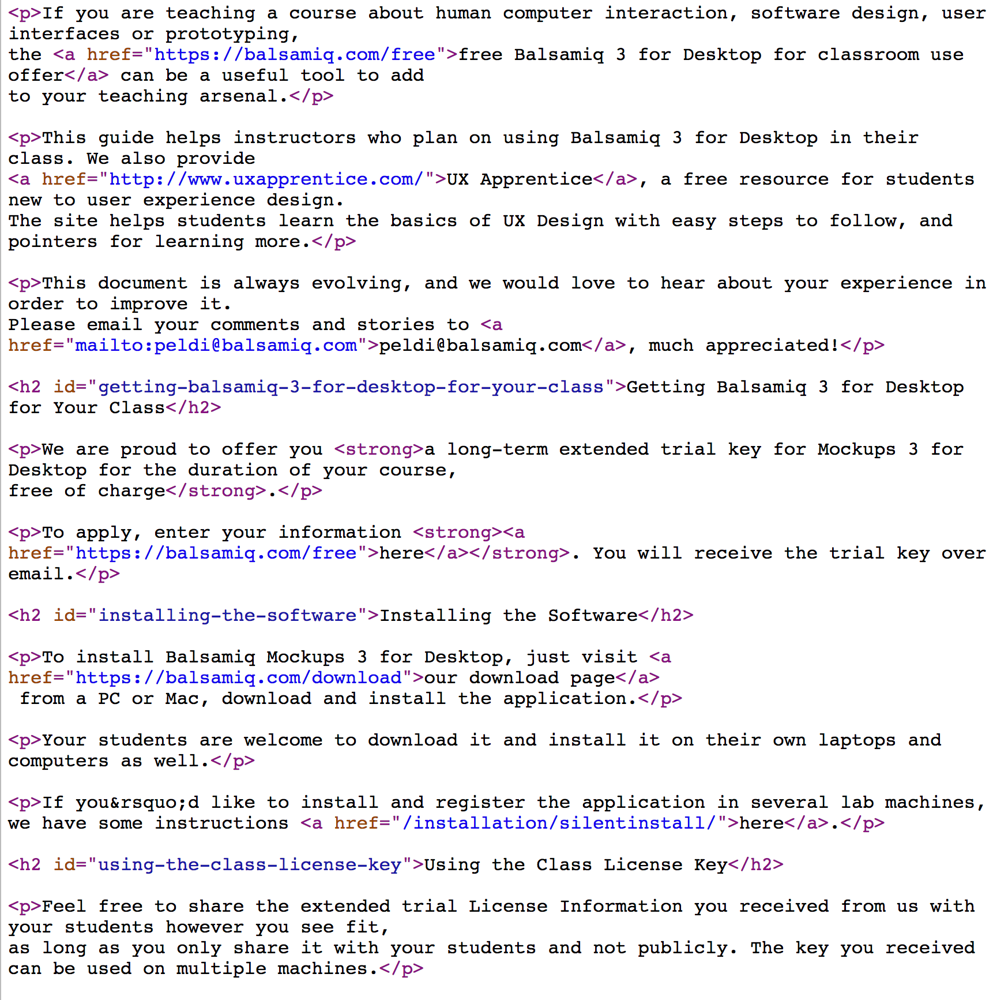
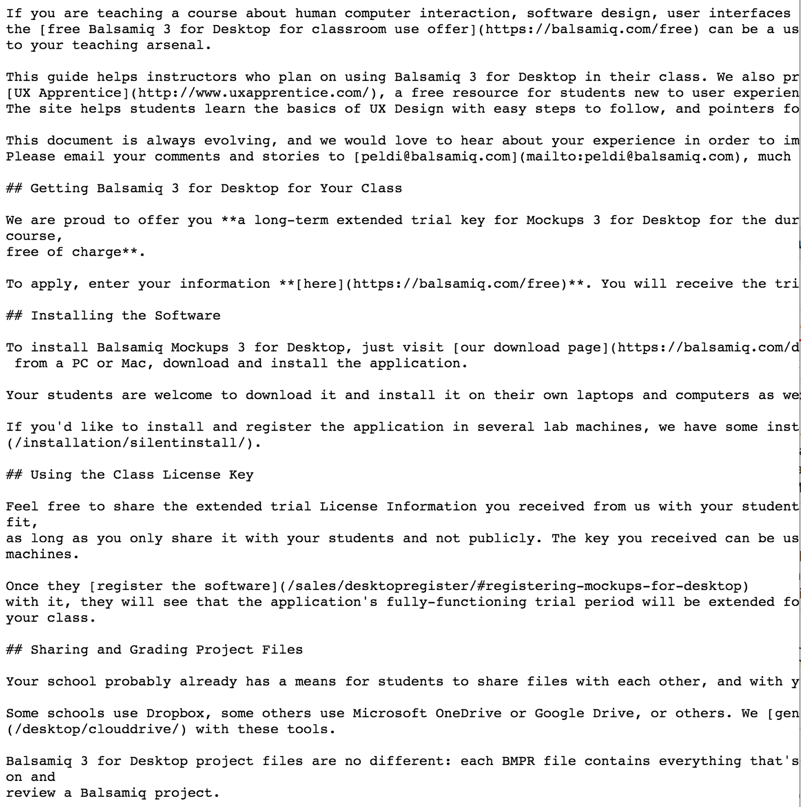

---

## 2. It's made for the web

* **HTML is to web media as PDF is to printed media.** It's universal. 

^ And everything is on the web now.

* No special software, platform, or configuration is required.

* Converting to HTML and vice-versa **isn't so much translating** one language to another as **compiling according to strict rules**.

^ i.e., there are clear, rigid rules rather than interpretations

^ it also natively supports writing in HTML

---

## 3. It's made for writing

* It's for *written documents*, with some images (like today's documentation and blogs)
* It's like HTML as it was originally intended
* Never write in "wysiwyg" view again!

 
**Note:** It's not good for *making* web sites

---

### (Detour)

**Q:** How do you build a website with Markdown?

**A:** You don't.

 
Sites that support Markdown use **templates** (built in Ruby, PHP, Go, etc.) that *embed* Markdown content in the appropriate place.

---

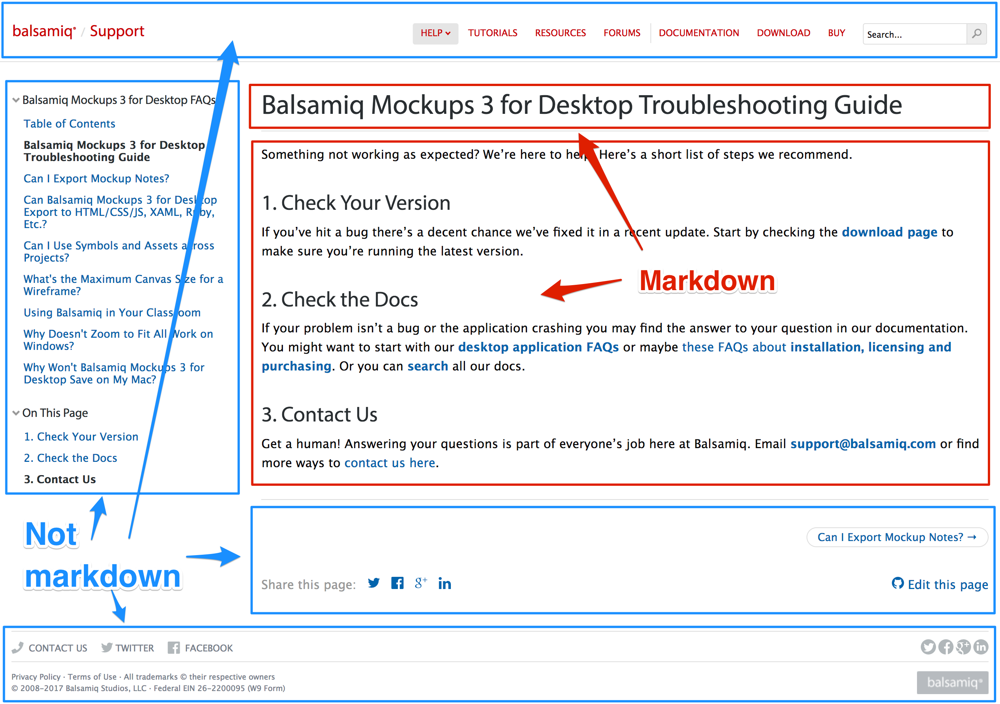

---

# Tip: Use it to organize your thoughts

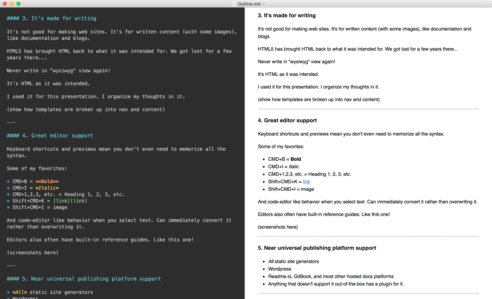

^ Not just for writing documents.

^ I used it for this presentation. I organize my thoughts in it.

---

# 😲*This presentation* is actually markdown

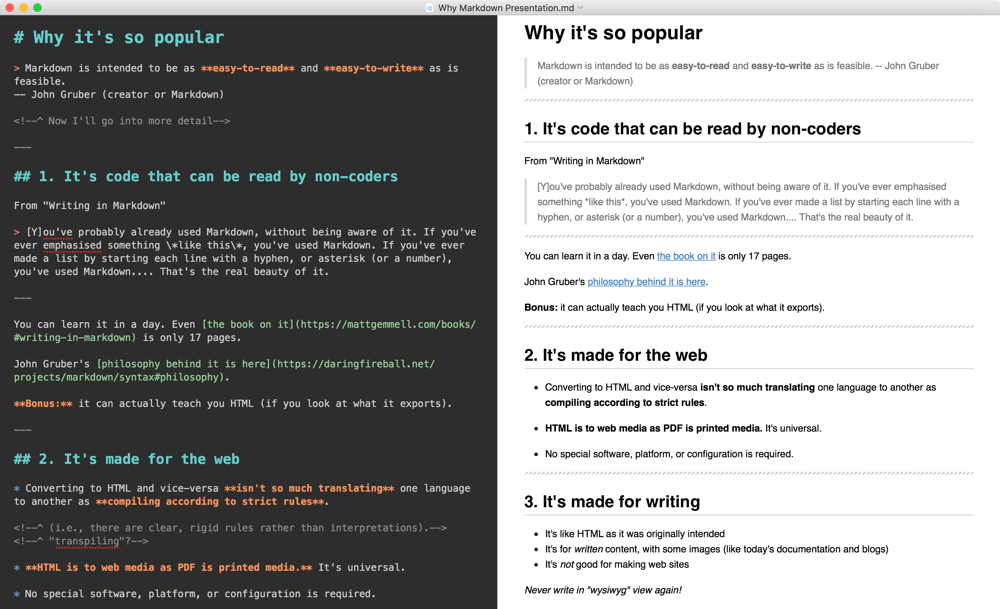

---

## 4. Great editor support

Keyboard shortcuts and live preview means you don't need to memorize all the syntax. 

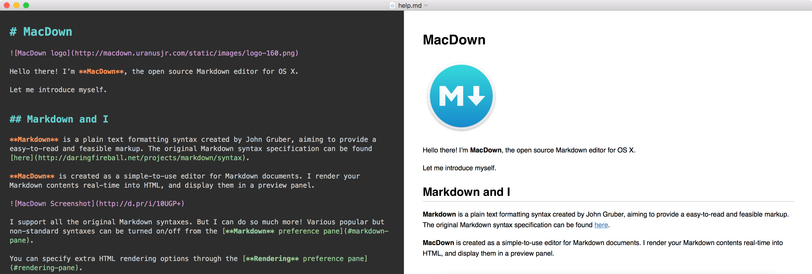

^ And code editor-like behavior when you select text. Can immediately convert it rather than overwriting it.

^ Editors also often have built-in reference guides. Like this one!

---

### Sample keyboard shortcuts

* CMD+B = **Bold**
* CMD+I = *Italic*
* CMD+1,2,3, etc. = Heading 1, 2, 3, etc.
* Shift+CMD+K = [link](link)
* Shift+CMD+I = image

^ Once you learn a few, writing in it is really fast.

---

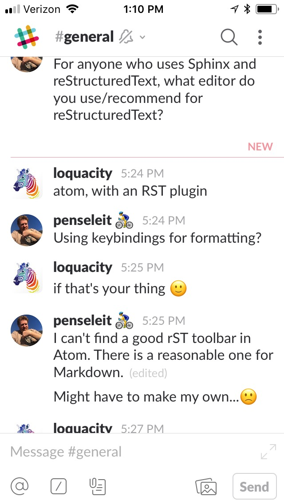
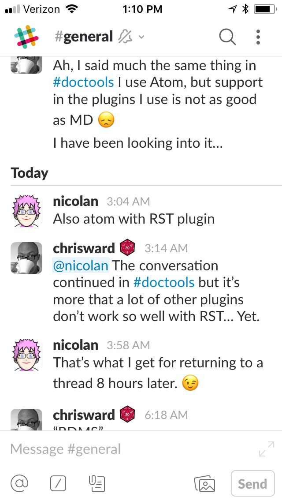
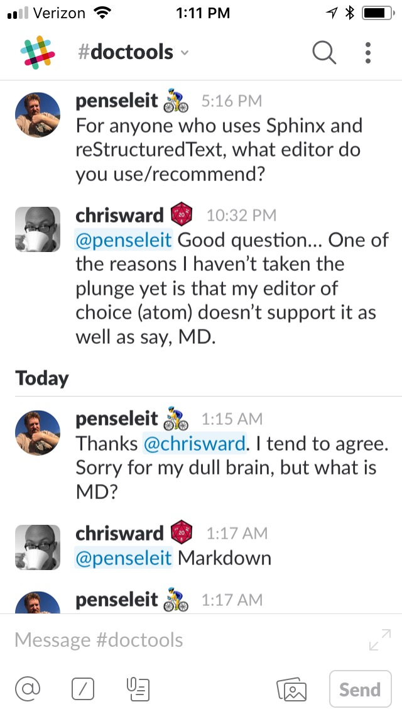

^ Discussion from Tuesday about editor support for Sphinx and RST

---

## 5. Near universal publishing platform support

* *All* static site generators
* Wordpress
* Readme.io, GitBook, and most other hosted docs platforms
* Anything that doesn't support it out-of-the-box has a plugin for it

---

# Summary

1. It's code for non-coders
2. It's made for the web
3. It's intended for writing
4. Great editor support
5. Broad publishing platform support

---

# Challenges

* Lack of features - e.g., includes/conrefs, crossrefs, etc.
* Lack of a standard

 
See [*"Why You Shouldn’t Use 'Markdown' for Documentation"*](http://ericholscher.com/blog/2016/mar/15/dont-use-markdown-for-technical-docs/) - by Eric Holscher

---

## "Flavors"?🍦

Add support for syntax highlighting, task lists, tables, etc.

* [GitHub Flavored Markdown](https://guides.github.com/features/mastering-markdown/#GitHub-flavored-markdown)
* [Markdown Extra](https://en.wikipedia.org/wiki/Markdown#Markdown_Extra)
* [Bitbucket](https://bitbucket.org/tutorials/markdowndemo)

^ You can adjust for some of these in the editor preferences.

---

# Helpful references 🤓

* ["Writing in Markdown" by Matt Gemmell](https://mattgemmell.com/writing-in-markdown/)
* [The Philosophy of Markdown by John Gruber](https://daringfireball.net/projects/markdown/syntax#philosophy)
* [GitHub Help - Basic Markdown writing and formatting syntax](https://help.github.com/articles/basic-writing-and-formatting-syntax/)
* [Online HTML to Markdown conversion tool](https://domchristie.github.io/to-markdown/)

---

## References (cont'd)

* [Marp - a free Markdown presentation writing tool](https://yhatt.github.io/marp/)
* [Deckset - a paid Markdown presentation tool](https://www.decksetapp.com/)
* [MacDown - my favorite Markdown editor for Mac](https://macdown.uranusjr.com/)
* [MarkdownPad - The Markdown Editor for Windows](http://markdownpad.com/)

---

# [fit] Thank you